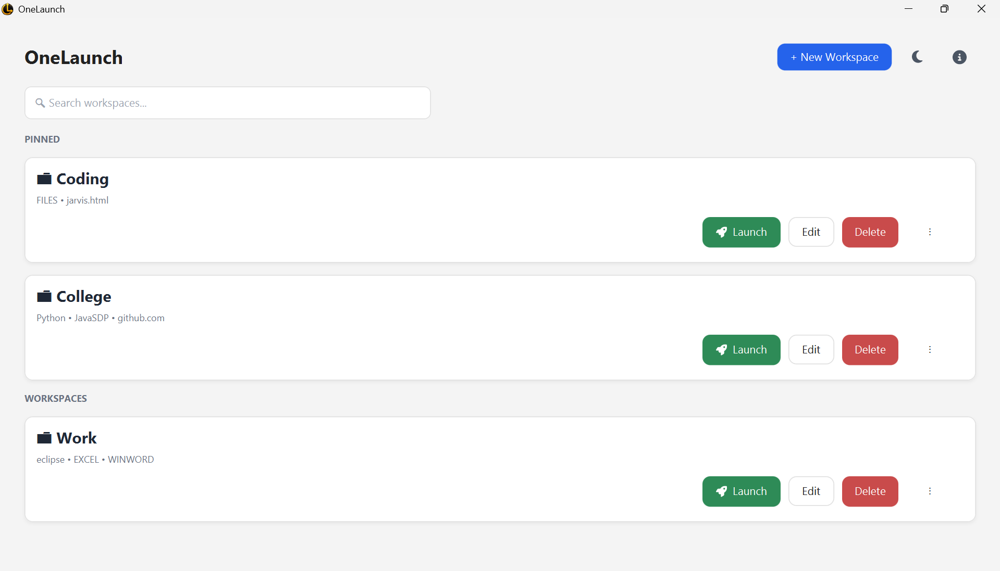
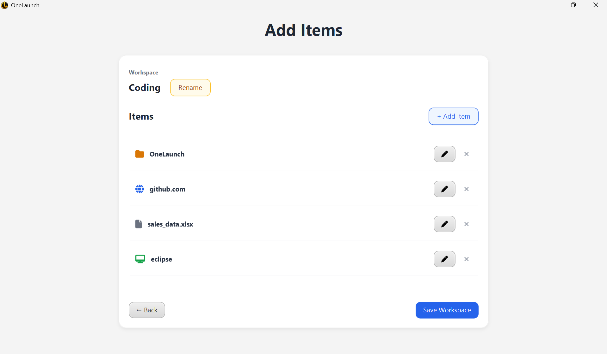
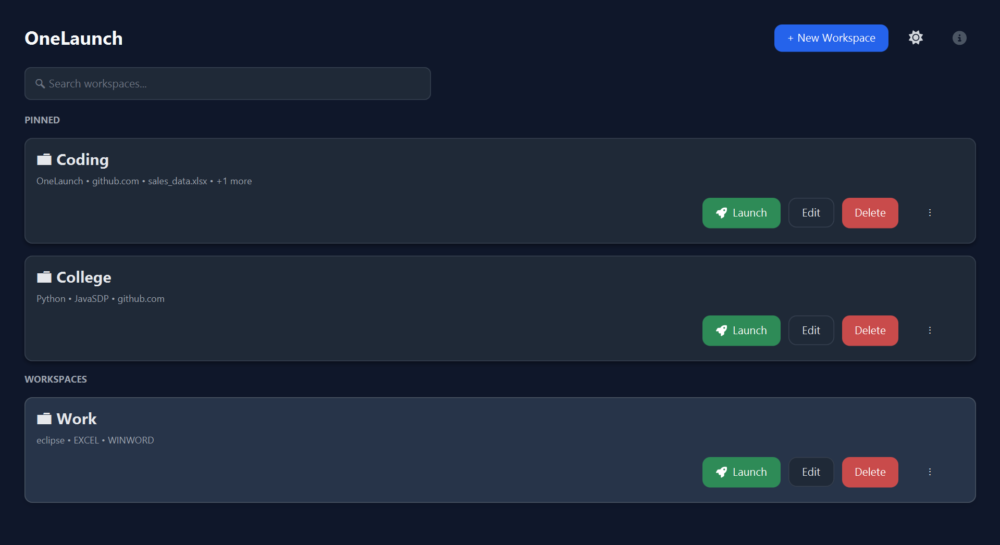
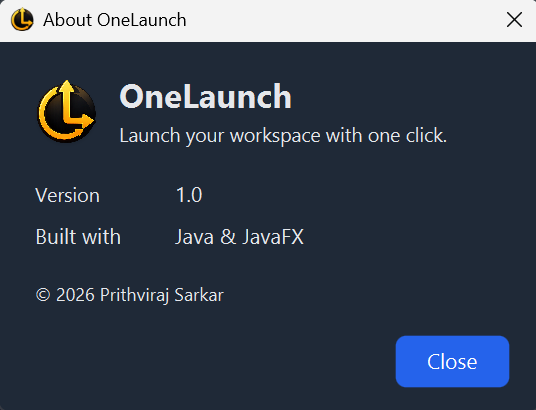

# OneLaunch

> Launch your workspace with one click.

OneLaunch is a Java desktop application built with JavaFX that lets users group applications, files, folders, and websites into reusable workspaces.

Instead of opening the same resources individually every time, users can save them as a workspace and launch them together with one click.

---

## Download

**Windows users:** [Download OneLaunch v1.0.1](https://github.com/PrithvirajSarkar/OneLaunch/releases/latest)

Download `OneLaunch-1.0.1.exe`, run the installer, and launch OneLaunch from the Desktop shortcut or Windows Start Menu.

> No Java installation is required when using the Windows installer. The installer includes the required Java runtime.

> **Windows security notice:** OneLaunch is currently not code-signed, so Windows may display an "Unknown publisher" warning when running the installer. Review the prompt and choose **Yes** if you trust the downloaded release.

---

## Screenshots

### Home Screen



The home screen provides quick access to saved workspaces, workspace search, pinning, editing, deletion, and one-click launching.

### Workspace Editor



A workspace can contain different types of launch items, including applications, files, folders, and websites.

### Add Items


Items can be added through a simple dialog that supports applications, files, folders, and websites.

### Dark Mode



OneLaunch includes a persistent dark theme that can be enabled from the main interface.

### About



The About dialog provides application information, version details, and the technology stack used to build OneLaunch.

---

## Features

### Workspace Management

- Create and edit workspaces
- Rename and delete workspaces
- Search workspaces
- Pin and unpin workspaces
- Prevent duplicate workspace names

### Launch Items

A workspace can contain:

- Applications
- Files
- Folders
- Websites

Each launch item stores its name, path or URL, and item type.

### Launching

OneLaunch can launch:

- Applications using `ProcessBuilder`
- Files using the desktop integration
- Folders using the desktop integration
- Websites using the system browser

Items are launched independently. If an item fails to launch, OneLaunch informs the user and allows them to either continue launching the remaining items or stop.

### Persistence

OneLaunch stores workspace and application settings locally using JSON files.

Workspace data and settings persist between application sessions.

### Dark Mode

OneLaunch provides light and dark application themes using separate CSS stylesheets.

The selected theme is persisted between application sessions.

### Error Handling

The application handles common problems such as:

- Empty workspace names
- Duplicate workspace names
- Duplicate launch items
- Invalid website URLs
- Empty workspace launches
- Failed application, file, folder, or website launches
- Corrupted workspace JSON
- Unsaved workspace changes

---

## Technology Stack

| Technology | Purpose |
|---|---|
| Java | Core application language |
| JavaFX | Desktop user interface |
| Maven | Build and dependency management |
| Gson | JSON serialization and deserialization |
| Ikonli | UI icons |
| CSS | Application themes |
| Git | Version control |
| jpackage | Windows application packaging |
| WiX Toolset | Windows installer generation |

---

## Architecture

OneLaunch uses a simple layered structure designed to keep responsibilities separated without introducing unnecessary complexity.

```text
OneLaunch
│
├── model
│   ├── Workspace
│   ├── LaunchItem
│   └── ItemType
│
├── service
│   ├── StorageManager
│   └── SettingsManager
│
├── ui
│   ├── Main
│   ├── HomeScreen
│   ├── AddWorkspaceScreen
│   └── AddItemsScreen
│
└── util
    ├── DialogUtil
    ├── DisplayNameUtil
    └── IconUtil
```

### Model

Represents the core application data.

The model layer contains:

- `Workspace`
- `LaunchItem`
- `ItemType`

### UI

Handles JavaFX screens and user interaction.

The UI layer contains:

- `Main`
- `HomeScreen`
- `AddWorkspaceScreen`
- `AddItemsScreen`

### Service

Handles persistent application data and settings.

The service layer contains:

- `StorageManager`
- `SettingsManager`

### Utility

Contains reusable functionality used throughout the application.

The utility layer contains:

- `DialogUtil`
- `DisplayNameUtil`
- `IconUtil`

More details are available in [Architecture](docs/Architecture.md).

---

## Data Storage

OneLaunch stores user-specific runtime data locally in the Windows application data directory:

```text
%LOCALAPPDATA%\OneLaunch
├── settings.json
└── workspaces.json
```

`workspaces.json` stores saved workspace information.

`settings.json` stores application settings such as the dark-mode preference.

This runtime data is user-specific and is not included in the Git repository.

If workspace data becomes corrupted, OneLaunch creates a backup of the corrupted workspace file before continuing.

---

## How It Works

### Create a Workspace

```text
Home
  ↓
Add Workspace
  ↓
Enter Name
  ↓
Add Items
  ↓
Save
```

### Add Launch Items

```text
Add Item
   │
   ├── Browse
   │    ├── Application
   │    ├── File
   │    └── Folder
   │
   └── Website
```

### Launch a Workspace

```text
Home
  ↓
Launch
  ↓
Launch Items
  ├── Applications
  ├── Files
  ├── Folders
  └── Websites
```

### Edit a Workspace

```text
Home
  ↓
Edit
  ↓
Modify Workspace
  ↓
Save
```

---

## Error Handling

OneLaunch uses user-facing dialogs to handle common failure cases instead of allowing unexpected application termination.

Examples include:

- Empty workspace names
- Duplicate workspace names
- Duplicate launch items
- Invalid website URLs
- Empty workspace launches
- Failed application launches
- Failed file launches
- Failed folder launches
- Failed website launches
- Corrupted workspace JSON
- Unsaved workspace changes

When corrupted workspace JSON is detected, OneLaunch creates a backup of the corrupted file before continuing.

---

## Project Structure

```text
OneLaunch/
│
├── .github/
│
├── docs/
│   ├── images/
│   │   ├── about.png
│   │   ├── add-item.png
│   │   ├── home-dark.png
│   │   ├── home-light.png
│   │   └── workspace-items.png
│   │
│   ├── Architecture.md
│   ├── FutureIdeas.md
│   └── UserGuide.md
│
├── src/
│   └── main/
│       ├── java/
│       │   └── onelaunch/
│       │       ├── model/
│       │       ├── service/
│       │       ├── ui/
│       │       └── util/
│       │
│       └── resources/
│
├── .gitignore
├── pom.xml
└── README.md
```

Runtime-generated user data is stored under `%LOCALAPPDATA%\OneLaunch` and is intentionally excluded from the repository.

---

## Requirements

### For Users

If you install OneLaunch using the Windows installer, **no Java, Maven, or Git installation is required**.

Download the installer from the [latest GitHub release](https://github.com/PrithvirajSarkar/OneLaunch/releases/latest).

### For Developers

To build OneLaunch from source, install:

- Java JDK 24
- Maven
- Git

Check your installation:

```bash
java -version
javac -version
mvn -version
```

---

## Running from Source

Clone the repository:

```bash
git clone https://github.com/PrithvirajSarkar/OneLaunch.git
cd OneLaunch
```

Build the project:

```bash
mvn clean package
```

Run the application:

```bash
mvn javafx:run
```

The exact runtime configuration is defined in `pom.xml`.

---

## Windows Installer

OneLaunch is packaged as a Windows executable using Java's `jpackage` tool and the WiX Toolset.

The Windows installer bundles the required Java runtime, allowing users to install and run OneLaunch without separately installing Java.

The installer also creates:

- A Windows Start Menu entry
- A Desktop shortcut

The current stable release is:

**OneLaunch v1.0.1**

[Download OneLaunch v1.0.1](https://github.com/PrithvirajSarkar/OneLaunch/releases/latest)

---

## Testing

The current project has been manually tested across the core workflows, including:

- Workspace creation
- Workspace editing
- Workspace deletion
- Workspace search
- Workspace pinning
- Application launching
- File launching
- Folder launching
- Website launching
- Duplicate detection
- Invalid URL handling
- Unsaved changes protection
- Dark-mode persistence
- Corrupted JSON recovery
- Backup creation
- Fresh Windows installation
- Workspace persistence after application restart
- Windows Start Menu shortcut
- Windows Desktop shortcut
- Installation and launch on a second Windows machine

The Maven project currently contains no automated test cases.

---

## Documentation

Additional project documentation is available here:

- [Architecture](docs/Architecture.md)
- [User Guide](docs/UserGuide.md)
- [Future Ideas](docs/FutureIdeas.md)

---

## Design Philosophy

OneLaunch intentionally keeps its architecture simple.

The project uses:

- JavaFX for the desktop interface
- JSON for local persistence
- Separate service classes for storage and settings
- Utility classes for reusable functionality
- Git for version control
- Maven for project and dependency management

The goal is to maintain clear separation of responsibilities without introducing unnecessary frameworks or abstractions for a relatively small desktop application.

---

## Project

OneLaunch is a Java desktop software engineering project focused on applying practical development concepts, including:

- Object-oriented programming
- JavaFX application development
- File-based persistence
- JSON serialization
- Input validation
- Error handling
- Software architecture
- Version control with Git
- Technical documentation
- Windows application packaging and distribution

---

## Release

### OneLaunch v1.0.1

The latest stable release of OneLaunch is available for Windows.

[Download OneLaunch v1.0.1](https://github.com/PrithvirajSarkar/OneLaunch/releases/tag/v1.0.1)
